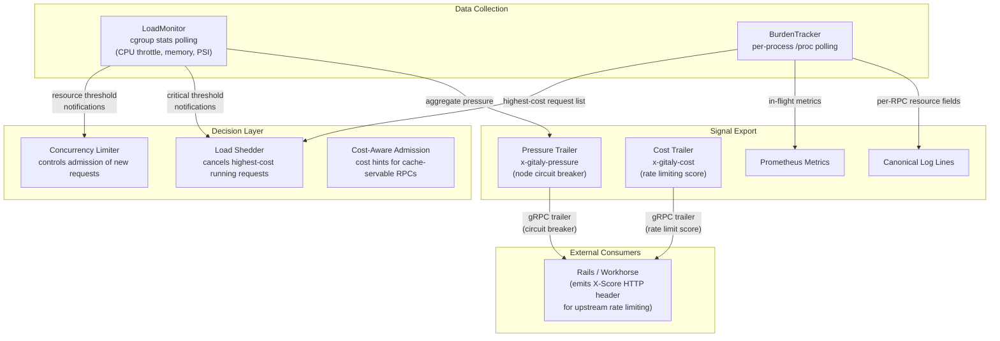
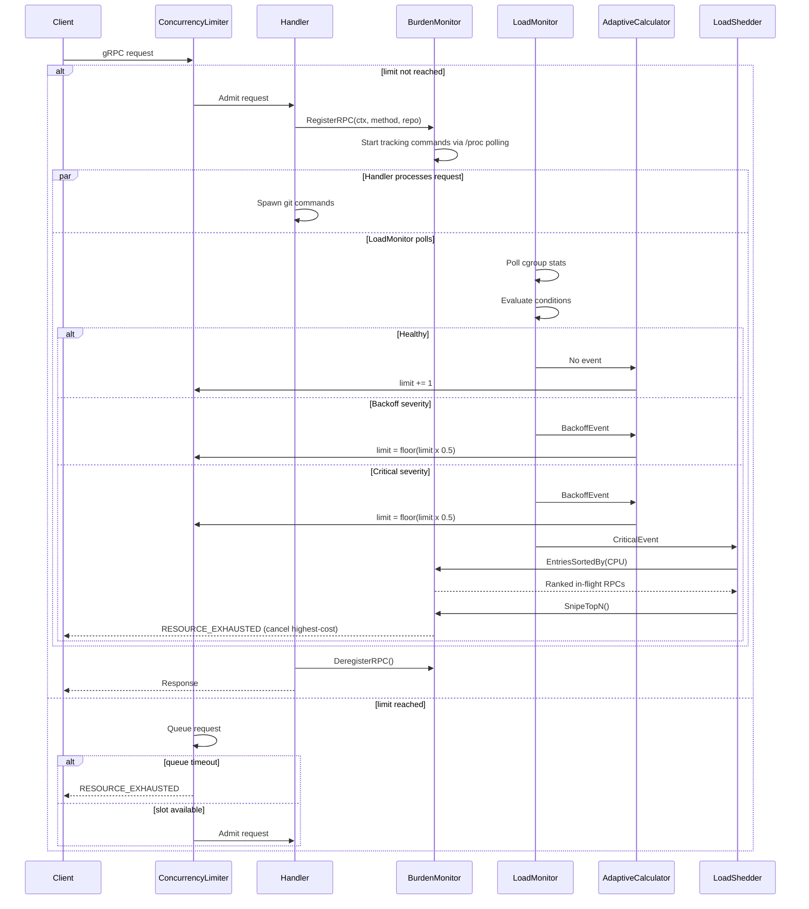

# Unified Load Management Architecture

## Architecture Overview

The system is organized into three layers: data collection, decision, and
signal export. The data collection layer gathers resource metrics. The
decision layer acts on those metrics to protect the system. The signal
export layer communicates Gitaly's state to external consumers.



## Data Collection Layer

Two complementary data sources that answer different questions.

### LoadMonitor

- Consolidates different watchers we have in Gitaly which helps in
  answering how stressed a system really is. Replaces the individual
  [`CgroupCPUWatcher`](../internal/limiter/watchers/cgroup_cpu_watcher.go),
  [`CgroupMemoryWatcher`](../internal/limiter/watchers/cgroup_memory_watcher.go), and
  [`CgroupPressureWatcher`](../internal/limiter/watchers/cgroup_pressure_watcher.go)
  that are currently coupled to the
  [`AdaptiveCalculator`](../internal/limiter/adaptive_calculator.go)
  through the `ResourceWatcher` interface
- Polls cgroup stats at configurable intervals (CPU throttling, memory
  usage, memory pressure events, PSI counters)
- Components register their own thresholds and receive notifications only when
  those thresholds are crossed
- Becomes the single source of truth for system-level resource metrics,
  including Prometheus gauges currently emitted by the [`cgroups`](../internal/cgroups/) package

### BurdenMonitor

This component would figure out which RPC/process is causing stress.

- Tracks all in-flight RPCs via gRPC interceptors: registers on entry,
  deregisters on exit
- Tracks spawned commands via the Git command factory
- Polls per-process stats from `/proc/[pid]/stat` and `/proc/[pid]/status`
  every x seconds using a single ticker and a bounded worker pool. This is
  primarily useful for long-running commands (large clones). Short-lived
  commands may complete before `/proc` is ever polled. This is acceptable as
  the commands that cause resource contention are mostly the long-running ones.
  A single ticker seems to be sufficient: benchmarks on a production node show ~250ms to
  read `/proc` for 209 concurrent Git processes. At the observed peak of ~1170
  processes during a DDoS incident, sequential polling extrapolates to ~1.4s —
  within the 2s interval but with thin margin. A bounded worker pool should parallelise the reads to stay well within the interval at peak load.
- Maintains ordered lists of running requests sorted by CPU time, memory,
  and duration
- Also addresses the need for periodic logging of long-running command
  resource consumption
  ([#7097](https://gitlab.com/gitlab-org/gitaly/-/work_items/7097)) -
  the BurdenMonitor already has the data, it just needs to emit periodic
  log entries for the top-N consumers

These two components have different polling targets (cgroups vs.
`/proc/[pid]`) and different granularity (system-wide vs. per-process).

## Decision Layer

Three components that act on the data. The concurrency limiter decides what gets
in. The load shedder decides what gets cancelled. The cost-aware admission
layer helps the rate limiter make better decisions about what to let in.

### Concurrency Limiter

Controls admission of new requests. The existing
[`AdaptiveCalculator`](../internal/limiter/adaptive_calculator.go) +
[`ConcurrencyLimiter`](../internal/limiter/concurrency_limiter.go):

- Subscribes to LoadMonitor threshold notifications.
- Requests that exceed the current concurrency limit are rejected before
  consuming resources.

### Load Shedder

The concurrency rate limiter reduces the flow of incoming requests when resources are
constrained, while load shedder controls in-flight requests. When resource pressure exceeds critical thresholds despite admission control, the load shedder identifies the
highest-cost running requests and cancels them to free resources
immediately.

- Subscribes to LoadMonitor notifications with critical thresholds (e.g.,
  OOM events, sustained extreme CPU throttle)
- When triggered, queries BurdenMonitor for the highest-cost running
  requests
- Cancels specific request contexts to recover capacity

## End-to-End Flow

The following diagram shows how a client request will flow through the system.



### Cost-Aware Admission

A separate admission layer that sits before the concurrency limiter in the
gRPC interceptor chain. If a request can be served from
[`streamcache`](../internal/streamcache/cache.go), it bypasses the concurrency
limiter entirely and proceeds directly to the handler. Currently this applies
to:

- [`PostUploadPackWithSidechannel`](../internal/gitaly/service/smarthttp/upload_pack.go) (clone/fetch)

```plaintext
Request -> Cost-Aware Admission -> Concurrency Limiter -> Handler
                 |
           (cache hit?)
                 |
           bypass limiter -> Handler directly
```

The concurrency limiter today treats every request as equally expensive. In
practice, requests served from cache consume minimal resources (disk streaming)
while cache misses run full Git subprocess pipelines. Rather than feeding the
limiter a cost hint (which still consumes a limiter slot), cache-hit requests
skip the limiter entirely — keeping the concurrency limiter pure and ensuring
limits designed for expensive operations do not penalize cheap ones.

This separation also keeps the concurrency limiter's responsibility narrow: every
request that reaches it is treated as expensive.

## Signal Export Layer

Gitaly exports two distinct signals per RPC response: a node-level pressure value
for circuit breaking, and a per-RPC cost score for rate limiting. These serve
different purposes and should not be conflated.

### Pressure Trailer (`x-gitaly-pressure`)

This layer attaches a `0.0`-`1.0` pressure value as a gRPC response trailer on every
RPC. The pressure value reflects the health of the entire Gitaly node — it is a
global signal, not per-project or per-namespace.

Client maintains a moving average of pressure per Gitaly storage and uses it to trip a circuit breaker for that node when sustained pressure is detected.

Rails will receive the pressure signal even for RPCs that bypass it (clone, fetch,
push), because other concurrent requests to the same node pass through Rails and
carry the trailer.

The pressure value comes from a `PressureAggregator` interface:

```go
type PressureAggregator interface {
    AggregatedPressure() float64
}
```

This interface allows the backing data source to evolve independently of
the gRPC interceptor that consumes it. Once the LoadMonitor becomes the single
polling point for all cgroup stats, the `PressureAggregator` implementation will
collect stats from LoadMonitor.

The [`CgroupPressureWatcher`](../internal/limiter/watchers/cgroup_pressure_watcher.go)
already reads PSI (Pressure Stall Information) data from the kernel for
memory, IO, and CPU. It classifies severity levels (healthy, warning,
backoff, critical) and has configurable thresholds.

| Signal | What it measures | Normalization |
|--------|------------------|---------------|
| PSI some avg10 (memory, IO, CPU) | % of time tasks were stalled waiting for a resource | `psi_avg10 / critical_threshold` per resource (thresholds already defined in [`CgroupPressureWatcher`](../internal/limiter/watchers/cgroup_pressure_watcher.go)) |
| Anonymous memory ratio | `TotalAnon / MemoryLimit` -- how close to the memory limit, excluding reclaimable page cache | `anon_ratio / memory_threshold` (threshold already defined in [`CgroupMemoryWatcher`](../internal/limiter/watchers/cgroup_memory_watcher.go), default 0.6) |
| CPU throttle ratio | `CPUThrottledDuration` delta over observation window | `throttle_ratio / cpu_threshold` (threshold already defined in [`CgroupCPUWatcher`](../internal/limiter/watchers/cgroup_cpu_watcher.go), default 0.5) |

The pressure value takes the maximum across all normalized signals:

```go
pressure = max(
    memory_psi_some_avg10 / memory_critical_threshold,
    io_psi_some_avg10     / io_critical_threshold,
    cpu_psi_some_avg10    / cpu_critical_threshold,
    anon_ratio            / memory_threshold,
    cpu_throttle_ratio    / cpu_throttle_threshold,
) clamped to [0.0, 1.0]
```

Additionally, discrete events spike pressure to 1.0 immediately:

- `OOMKills` counter increased since last poll
- `MemoryMaxEvents` counter increased (memory nearly exceeded hard limit)

The thresholds are already calibrated by the existing watcher implementations, so the
pressure value aligns with the points where the system starts to degrade.

### RPC Cost Score (`x-gitaly-cost`)

Gitaly returns a cost score for each RPC as a gRPC response trailer.
Gitaly has the most context about the actual cost of each RPC, making it the right
place to own this value. Rails and Workhorse translate the `x-gitaly-cost`
trailer into an `X-Score` HTTP response header, making the cost signal
available to any upstream rate limiter.

> On GitLab.com, the `X-Score` header feeds Cloudflare's
> [complexity-based rate limiting](https://developers.cloudflare.com/waf/rate-limiting-rules/request-rate/#complexity-based-rate-limiting).
> Self-managed deployments can use the same header with any upstream
> rate limiter or ignore it.

Static scores are derived from historical data per RPC type. A static score hides
variance (e.g. `PostUploadPackWithSidechannel` is the same cost whether it serves
1 MB or 10 GB), but dynamic cost (bytes transferred, object count) is only known
after the RPC completes. The two approaches can be combined: use the static score
as a base, then reconcile actual cost in a follow-up after Gitaly responds.

### Prometheus Metrics

- BurdenMonitor: in-flight count and CPU/memory per RPC and cumulative CPU time and memory consumed
- LoadMonitor: current value per signal PSI avg10, anon ratio, CPU throttle and time spent at each severity level per signal.
- Pressure: `gitaly_pressure` aggregated 0.0–1.0 per storage and `gitaly_pressure_seconds_total` by severity level.

## Connection to Rails and Workhorse

Gitaly's role in the broader DoS mitigation system is to be the innermost
ring of defense and to communicate two signals outward: node health (for
circuit breaking) and per-RPC cost (for rate limiting).

**What Gitaly provides:**

- `x-gitaly-pressure` gRPC trailer on every response (0.0 = healthy,
  1.0 = saturated) — node health signal
- `x-gitaly-cost` gRPC trailer on every response — per-RPC cost score
- `RESOURCE_EXHAUSTED` gRPC errors when requests are rejected by the
  concurrency limiter or load shedder.

**What Rails does with it:**

- Reads the `x-gitaly-pressure` trailer via a gRPC client interceptor
- Maintains a moving average of pressure per Gitaly storage
- Trips a per-node circuit breaker when sustained pressure is detected
- Translates `x-gitaly-cost` into the `X-Score` HTTP response header for
  upstream consumption

For standard requests, Rails is in the response path:

```plaintext
(upstream rate limiter) <- X-Score header <- Rails <- x-gitaly-cost trailer <- Gitaly
```

For Git operations (clone, fetch, push), Workhorse streams directly
to/from Gitaly — Rails is only in the auth path. Workhorse reads the
`x-gitaly-cost` trailer from the Gitaly response and sets `X-Score` on
the HTTP response to the client:

```plaintext
(upstream rate limiter) <- X-Score header <- Workhorse <- x-gitaly-cost trailer <- Gitaly
                                    |
                           Rails auth response
```
