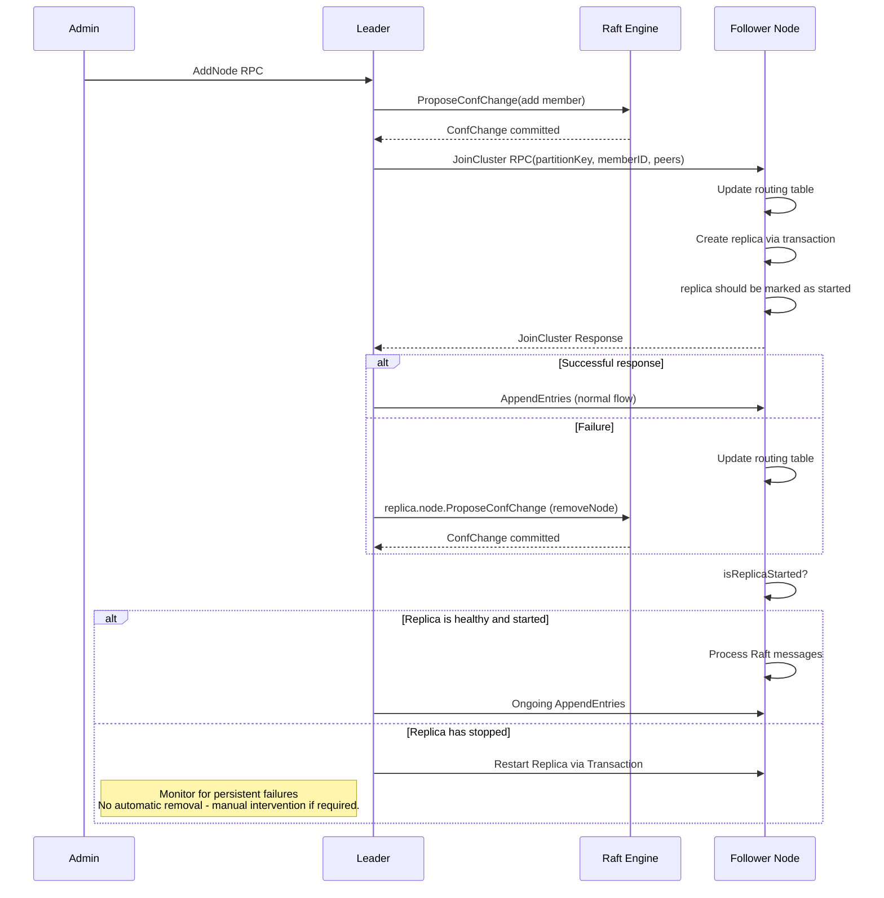

# Gitaly Cluster (Raft) architecture

## Storage hierarchy

The unit of Git data storage is the **repository**. Repositories in a Gitaly Cluster (Raft) are hosted within
**storages**, each with a globally unique name. A Gitaly server can host multiple storages simultaneously. Downstream
services, particularly GitLab Rails, maintain a mapping between repositories, storages, and the addresses of the servers
hosting them.

Within each storage, repositories are grouped into **partitions**. A partition may consist of a single repository or a
collection of related repositories, such as those belonging to the same object pool in the case of a fork network.
Write-Ahead Logging (WAL) operates at the partition level, with all repositories in a partition sharing the same
monotonic log sequence number (LSN). Partition log entries are applied sequentially.

The [`raftmgr` package](https://gitlab.com/gitlab-org/gitaly/-/tree/master/internal/gitaly/storage/raftmgr)
manages each partition in a separate Raft consensus group (Raft group), which operates
independently. Partitions are replicated across multiple storages. Storage is where partitions are placed. If a
storage creates a partition, it mints its ID, but there's no special relationship between the partition and
storage. A partition can be moved freely to another storage. At any given time, a single Gitaly server can host thousands
or even hundreds of thousands of Raft groups.

Partitions are replicated across multiple storages. A storage can host both its own partitions and replicas of
partitions from other storages.

The data size and workload of partitions vary significantly. For example, a partition containing a monorepo and
its forks can dominate a server's resource usage and traffic. As a result, replication factors and routing tables are
designed at the partition level. Each partition can define its own replication constraints, such as locality and
optional storage capacity (e.g., HDD or SSD). Customizable resources for the data and workload on a partition is the
main benefit of Gitaly Cluster (Raft).

## Partition identity and membership management

Each partition in a cluster is identified by a globally unique **PartitionKey**. The PartitionKey of a partition is
generated once when it is created. Under the hood, the PartitionKey is a SHA256 hash of
`(Authority Name, Local Partition ID)`, in which:

- Authority Name: Represents the storage that created the partition.
- Local Partition ID: A local, monotonic identifier for the partition within the authority's storage.

This identity system allows distributed partition creation without the need for a global ID registry. A partition can
move freely to other storages after creation due to replication, and ownership of a partition can change based on the
current leadership.

Each partition is a Raft group with one or more members. Raft groups are also identified by the PartitionKey due to
the one-to-one relationship.

The [`raftmgr.Replica`](https://gitlab.com/gitlab-org/gitaly/-/blob/master/internal/gitaly/storage/raftmgr/replica.go)
oversees all Raft activities for a Raft group member. Internally, etcd/raft assigns an
integer **Member ID** to a Raft group member. The Member ID does not change throughout the lifecycle of a group member.

When a partition is bootstrapped for the first time, the Raft replica:

1. Initializes the [`etcd/raft`](https://github.com/etcd-io/raft) state machine.
1. Elects itself as the initial leader.
1. Persists all Raft metadata to persistent storage.

Its internal Member ID is always 1 at this stage, making it a fully functional single-node Raft instance.

When a new member joins a Raft group, the leader issues a configuration change entry. This entry contains the metadata
of the storage, such as storage name, address, and authentication/authorization information. The new member's Member ID
is assigned the LSN of this log entry, ensuring unambiguous identification of members. As the LSN is monotonic,
Member IDs are never reused even if the storage re-joins later. This Member ID system is not exposed outside the
scope of `etcd/raft` integration.

Because Gitaly Cluster (Raft) follows a multi-Raft architecture, where a single member can host many partitions, the Member ID alone is insufficient to precisely locate
a partition or Raft group replica. Therefore, each replica (including the leader) is identified using a
**Replica ID**, which consists of `(PartitionKey, Member ID, Replica Storage Name)`.

To ensure fault tolerance in a quorum-based system, a Raft cluster requires a minimum replication factor of 3.
It can tolerate up to `(n-1)/2` failures. For example, a 3-replica cluster can tolerate 1 failure.

The cluster maintains a global, eventually consistent **routing table** for lookup and routing purposes. Each entry
in the table includes:

```plaintext
PartitionKey: [
    RelativePath: "@hashed/2c/62/2c624232cdd221771294dfbb310aca000a0df6ac8b66b696d90ef06fdefb64a3.git"
    Replicas: [
      <Replica ID 1, Replica 1 Metadata>
      <Replica ID 2, Replica 2 Metadata>
      <Replica ID 3, Replica 3 Metadata>
    ]
    Term: 99
    Index: 80
}
```

The current leader of the Raft group is responsible for updating the respective entry in the routing table. The routing
table is updated only if the replica set changes. Leadership changes are not broadcasted due to the high number of Raft
groups and the high update frequency. The routing table and advertised storage addresses are propagated via the
gossip network.

The `RelativePath` field in the routing table aims to maintain backward compatibility with GitLab-specific clients. It is
removed after clients fully transition to the new PartitionKey system. The `Term` and `Index` fields ensure the order of
updates. Entries of the same PartitionKey with either a lower term or index are replaced by newer ones.

The following chart illustrates a simplified semantic organization of data (not actual data placement) on a Gitaly
server.

```plaintext
gitaly-server-1344
|_ storage-a
   |_ <Replica ID>
      |_ repository @hashed/aa/aabbcc...git
      |_ repository @hashed/bb/bbccdd...git (fork of @hashed/aa/aabbcc...git)
      |_ repository @hashed/cc/ccddee...git (fork of @hashed/aa/aabbcc...git)
   |_ <Replica ID> (current leader)
      |_ repository @hashed/dd/ddeeff...git
   |_ <Replica ID>
      |_ repository @hashed/ee/eeffgg...git
   |_ <Replica ID> (current leader)
      |_ repository @hashed/ff/ffgghh...git
   |_ <Replica ID>
      |_ repository @hashed/gg/gghhii...git
   |_ ...
```

## Communication between members of a Raft group

The `etcd/raft` package does not include network communication implementation. Gitaly uses gRPC to transfer messages.
Messages are sent through a single RPC, `RaftService.SendMessage`, which enhances Raft messages with Gitaly partition
identity metadata. Membership management is facilitated by another RPC (TBD).

Given that a Gitaly server may host a large number of Raft groups, the "chatty" nature of the Raft protocol can
cause potential issues. Additionally, the protocol is sensitive to health-check failures. To mitigate these challenges,
Gitaly applies techniques such as batching node health checks and quiescing inactive Raft groups.

## Communication between client and Gitaly Cluster (via Proxying)

TBD

## Interaction with Transactions and WAL

The Raft replica implements the `storage.LogManager` interface. By default, the Transaction Manager uses `log.Manager`.
All log entries are appended to the file system WAL. Once an entry is persisted, it is ready to be applied by the
Transaction Manager. When Raft is enabled, `log.Manager` is replaced by `raftmgr.Manager` which manages the entire
commit flow, including network communications and quorum acknowledgment.

The responsibilities of three critical components are:

- `log.Manager`: Handles local log management.
- `raftmgr.Replica`: Manages distributed log management.
- `partition.TransactionManager`: Manages transactions, concurrency, snapshots, conflicts, and related tasks.

The flow is illustrated in the following chart:

```plaintext
                                              ┌──────────┐
                                              │Local Disk│
                                              └────▲─────┘
                                                   │
                                               log.Manager
                                                   ▲
TransactionManager    New Transaction              │ Without Raft
         │                   ▼                     │
         └─►Initialize─►txn.Commit()─►Verify─► AppendLogEntry()─────►Apply
                │                                  │
                │                                  │ With Raft
                ▼                                  ▼
         ┌─►Initialize─────...──────────────────Propose
         │                                         │
raftmgr.Replica                          etcd/raft state machine

                                           ┌───────┴────────┐
                                           ▼                ▼
                                    raftmgr.Storage raftmgr.Transport
                                           │                │
                                           ▼                │
                                       log.Manager       Network
                                           │                │
                                     ┌─────▼────┐     ┌─────▼────┐
                                     │Local Disk│     │Raft Group│
                                     └──────────┘     └──────────┘
```

### Bootstrap Raft Replica on a remote node

Bootstrapping replicas on remote nodes is a critical operation for maintaining cluster health, performance, and
availability in distributed settings. This process ensures that partitions are properly replicated across multiple nodes
to maintain consistency and fault tolerance. Replicas are bootstrapped during an add-join operation or a replication event.

Because the lifecycle of a replica is managed by transaction, during a join or replication event the replica need to be
started via transaction.

To bootstrap a replica on a remote node, we need to propagate the same PartitionKey that is being used by the leader.
The PartitionKey is what makes the replica identifiable as part of the specific Raft group managing that partition. When
a replica is created by a transaction, it receives a local partition ID.

However, to maintain consistency across the cluster, the follower must be registered under the PartitionKey provided by
the leader.

The replica bootstrapping process is handled as part of the JoinCluster RPC, which is invoked by the leader after
proposing the configuration change. Using this RPC, the leader sends the PartitionKey, peer list, relative path, and
other necessary parameters. These are used by the destination storage to update its routing table and initiate a
transaction that creates the new partition.



## References

- [Raft-based decentralized architecture for Gitaly Cluster](https://gitlab.com/groups/gitlab-org/-/epics/8903)
- [In Search of an Understandable Consensus Algorithm](https://raft.github.io/raft.pdf)
- [Consensus: Bridging Theory and Practice](https://github.com/ongardie/dissertation)
- [etcd/raft package documentation](https://pkg.go.dev/go.etcd.io/raft/v3)
