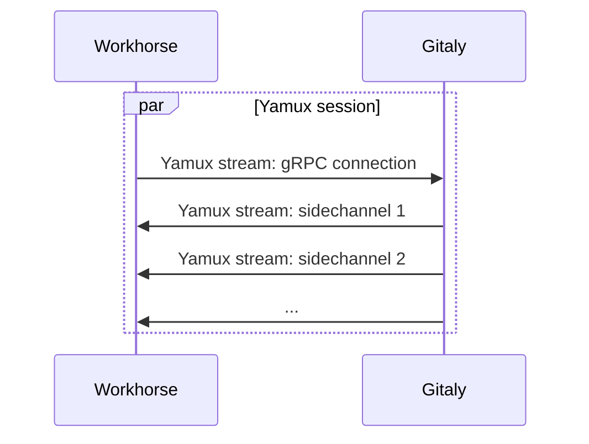

# Gitaly sidechannels

Since GitLab 14.4, Gitaly supports a custom protocol for RPCs that
transfer a high volume of byte stream data. Currently, this only
applies to `PostUploadPackWithSidechannel`, which is used for Git HTTP
traffic, as well as `SSHUploadPackWithSidechannel` for SSH traffic, as well as
`PackObjectsHookWithSidechannel`.

Prior to sidechannel, the only way for Gitaly to serve a byte stream
was to encapsulate the bytes in gRPC Protobuf messages. Because of the
per-message overhead, this acted as a limiting factor on how much Git
fetch traffic a Gitaly server could serve up.

The sidechannel protocol works around this by:

1. Allowing the Gitaly server to establish a sidechannel to the Gitaly client during an RPC call.
1. Performing the bulk data transfer on the sidechannel.

## What is a sidechannel?

A sidechannel is another byte stream sent over the same TCP connection.

- Stream 1: gRPC connection (persistent, used for control)
- Stream 2: Backchannel (persistent, used by Praefect for voting)
- Stream 3: First sidechannel (short-lived)

The data from these streams will then be interleaved into the TCP segments:

```plaintext
TCP Connection (byte stream):
═══════════════════════════════════════════════════════════════════════════════════════

┌────────────────┬────────────────┬────────────────┬────────────────┬────────────────┬────────────────┐
│   Segment 1    │   Segment 2    │   Segment 3    │   Segment 4    │   Segment 5    │   Segment 6    │
├────────────────┼────────────────┼────────────────┼────────────────┼────────────────┼────────────────┤
│ gRPC Request   │ Sidechannel    │ Sidechannel    │ gRPC Request   │ Sidechannel    │ Sidechannel    │
│ Stream 1       │ Stream 3       │ Stream 3       │ Stream 1       │ Stream 3       │ Stream 3       │
│ Length: 100    │ Length: 0      │ Length: 8192   │ Length: 50     │ Length: 8192   │ Length: 8192   │
├────────────────┼────────────────┼────────────────┼────────────────┼────────────────┼────────────────┤
│ "PostUpload    │ (Open stream)  │ Packfile       │ Metadata       │ Packfile       │ Packfile       │
│  Pack..."      │                │ bytes 0-8K     │                │ bytes 8K-16K   │ bytes 16K-24K  │
└────────────────┴────────────────┴────────────────┴────────────────┴────────────────┴────────────────┘

═══════════════════════════════════════════════════════════════════════════════════════
```

The gRPC call is then only used for:

- Parameters such as which repository we're reading data from.
- Control information such as the status code and possible error value returned by the server.

To make this possible without needing extra network ports we use a
connection multiplexing library called
[Yamux](https://github.com/hashicorp/yamux). Yamux enables us to
establish multiple virtual network connections (Yamux "streams")
within a single real network connection (a Yamux "session"). The
Gitaly client establishes one (persistent) Yamux stream to make gRPC
calls on. Everytime a sidechannel is needed, the Gitaly server will
establish a short-lived Yamux stream in the opposite direction.



Because the connection between Workhorse and Gitaly is now a Yamux
connection instead of a gRPC connection, you can't
route Workhorse->Gitaly traffic through a gRPC proxy. If you need a
proxy between Workhorse and Gitaly, use a TCP proxy instead.

For more information about how and why we introduced sidechannels, see
<https://gitlab.com/groups/gitlab-com/gl-infra/-/epics/463>.

## Implementation details

Sidechannels are built on top of the `backchannel` infrastructure that
Praefect uses for server-to-client communication.

### Connection Setup

When a client connects to Gitaly with sidechannel support enabled:

1. A **Yamux multiplexing session** is established on the TCP connection
1. **Two persistent streams** are created:
   - **Stream 1**: Client → Server gRPC connection (for regular RPC calls)
   - **Stream 2**: Server → Client backchannel (for server-initiated RPC calls)

NOTE: When Praefect is not in use, the backchannel stream does not actually get
used. When Praefect is enabled, it is used for voting.

### Sidechannel Usage

When an RPC needs to transfer bulk data (e.g., `PostUploadPackWithSidechannel`):

1. The server opens a **new short-lived Yamux stream**
1. Bulk data flows over this stream without gRPC/Protobuf overhead
1. The stream closes when the data transfer completes
1. The gRPC call returns with status and metadata
