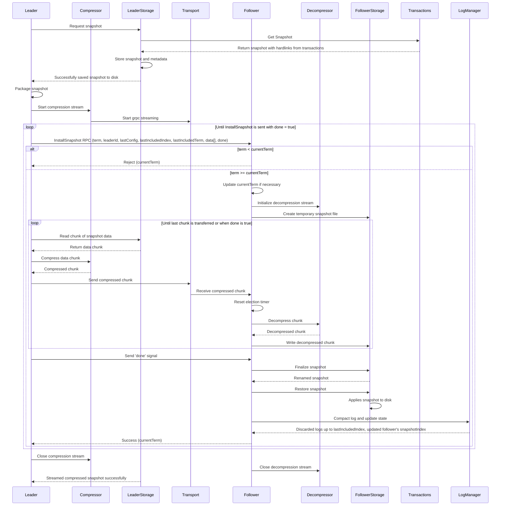

## Raft Snapshots
#### Streaming Snapshots 
When a new follower with no state joins the cluster, the leader may send a streaming snapshot requested on demand to let it catch up to the latest state. Another use case is when a follower is too far behind and is in need of entries that have already been compacted on the leader, the leader will have to send a snapshot over the network. 

When the leader starts a transaction to invoke InstallSnapshot RPC, it will reuse the snapshot created in that transaction by materialising it as an archive of the snapshot. Considerable space will be needed for this packaging step if performed on disk. Hence, streaming is used to avoid buffering the entire state machine in memory and having to store yet another compressed copy of the archive. 

Compression and checksum will be used for reducing the size of a snapshot and maintaining data integrity respectively. Hence our approach is to implement streaming compression so the sending of chunks and compression happens simultaneously.

Snapshots will be initially created as a .tmp file in the configured raft SnapshotDir. Once the entire operation is done, it will be renamed with a .snap extension and flushed to disk ensuring no node will receive a half written snapshot.

